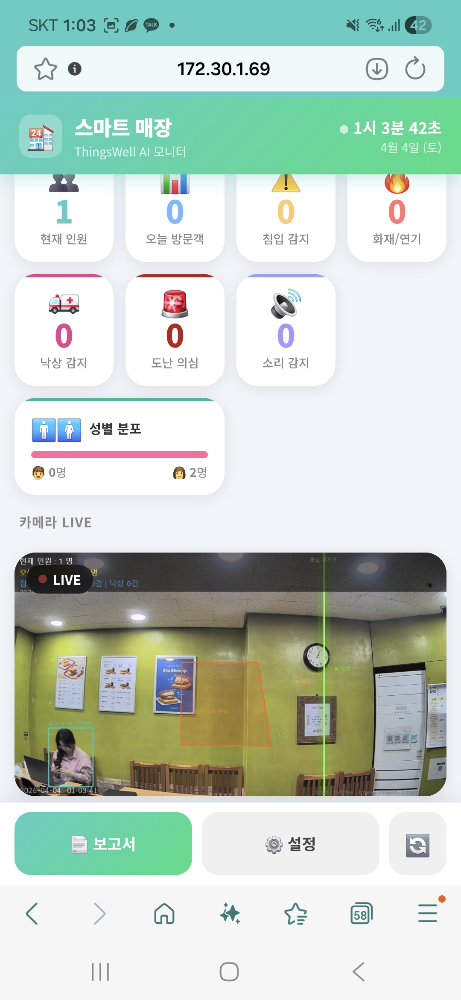
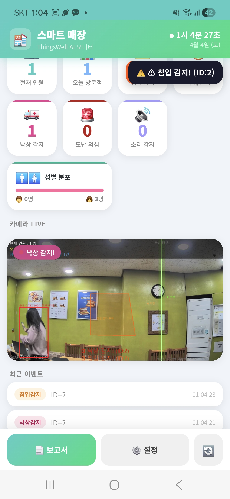

<div align="center">


# 스마트 매장 AI 관리 시스템

**이삭토스트 지점 전용 | ThingsWell AI Monitor**

CCTV 한 대로 방문객 카운팅 · 도난 · 낙상 · 화재 · 침입을 동시에 감지하고  
사장님 카카오톡으로 즉시 알림을 보내는 소형 매장 특화 AI 솔루션

</div>

---

## 실행 화면

<table>
<tr>
<td align="center"><b>대시보드 (PWA)</b></td>
<td align="center"><b>카메라 LIVE + 이벤트</b></td>
</tr>
<tr>
<td></td>
<td></td>
</tr>
</table>

> 핸드폰에 앱처럼 설치(PWA) → 매장 어디서든 실시간 확인

---

## 주요 기능

| 기능 | 방식 | 알림 |
|------|------|------|
| **피플카운팅** | YOLO + ByteTracker 경계선 출입 감지 | 대시보드 실시간 |
| **침입 감지** | Zone polygon 진입 감지 | 카카오톡 + TTS |
| **도난 의심** | Gemini 1.5 Flash VLM (행거 10초 체류 후 판단) | 카카오톡 + 경보음 |
| **낙상 / 쓰러짐** | YOLO Pose 17 keypoint 척추 기울기 | 카카오톡 + TTS |
| **화재 / 연기** | HSV 색상 적응형 분석 | 카카오톡 + TTS |
| **소리 감지** | YAMNet TFLite 521종 분류 (비명·유리깨짐) | 대시보드 알림 |
| **사장님 얼굴 인식** | OpenCV Haar Cascade 히스토그램 | 도난 알람 제외 |
| **일/주/월 보고서** | CSV 자동 누적 → HTML 시각화 | 버튼 1번 |

---

## 시스템 구성

```
이삭토스트 매장
  │
  ├─ IP 카메라 (ipTIME C400G)
  │     RTSP over TCP → OrangePi
  │
  ├─ OrangePi Edge2 (ARM64, Linux)
  │     YOLOv8n-Pose ONNX 추론
  │     FastAPI 웹 서버 :38241
  │
  └─ 사장님 핸드폰
        PWA 앱으로 설치 (홈 화면)
        카카오톡 즉시 알림
```

---

## 하드웨어 준비

| 항목 | 권장 사양 |
|------|----------|
| **AI 보드** | OrangePi Edge2 (RK3588, 8GB) |
| **OS** | Ubuntu 22.04 for OrangePi |
| **Python** | **3.11.x** (tflite-runtime 호환 필수) |
| **카메라** | IP Camera (RTSP 지원) — ipTIME C400G 검증 완료 |
| **저장공간** | 16GB 이상 (모델 + 로그) |

---

## OrangePi 설치

### 1. 저장소 복제

```bash
git clone https://github.com/susie1214/issac_store_cctv.git
cd issac_store_cctv
```

### 2. Python 3.11 확인

```bash
python3 --version   # 반드시 3.11.x
```

Python 3.11이 없으면:
```bash
sudo apt install python3.11 python3.11-venv python3.11-dev -y
```

### 3. 패키지 설치

```bash
python3.11 -m venv venv
source venv/bin/activate
pip install -r requirements_orangepi.txt
```

### 4. AI 모델 다운로드

```bash
python download_models.py
```

다운로드되는 파일:
```
models/
├── yolov8n-pose.onnx    # 낙상·피플카운팅 (메인 모델)
├── yamnet.tflite        # 소리 감지 (비명·유리깨짐)
└── yamnet_class_map.csv # 521종 클래스 목록
```

### 5. 환경 변수 설정

```bash
cp .env.example .env
nano .env
```

```env
GEMINI_API_KEY=your_gemini_api_key_here
KAKAO_REST_API_KEY=your_kakao_rest_api_key_here
```

> **Gemini API** → [Google AI Studio](https://aistudio.google.com) 에서 무료 발급  
> **카카오 REST API** → [Kakao Developers](https://developers.kakao.com) 앱 생성 후 발급

### 6. 카카오톡 인증 (최초 1회)

```bash
python kakao_notify.py --auth
```

브라우저 열림 → 카카오 로그인 → 승인 → `models/kakao_token.json` 자동 저장

### 7. 사장님 얼굴 등록 (도난 알람 제외 처리)

사장님·직원 사진을 `9.jpg`로 저장 후:
```bash
python face_manager.py
```

```
등록 완료! → models/face_encodings.pkl
```

추가 등록이 필요하면 `face_manager.py` 마지막 줄에서 이름과 파일명 변경:
```python
ok = fm.register("직원이름", "photo.jpg")
```

### 8. 카메라 설정

```bash
nano config.json
```

```json
{
  "camera": {
    "source": "rtsp://admin:비밀번호@카메라IP:554/onvif1",
    "width": 640,
    "height": 480
  },
  "detection": {
    "model": "yolov8n-pose.onnx",
    "conf": 0.40,
    "infer_every": 7
  }
}
```

> ipTIME C400G 기준: 경로 `/onvif1`, RTSP over TCP 자동 적용

### 9. 실행

```bash
chmod +x start.sh
./start.sh
```

출력 예시:
```
======================================================
  스마트 매장 관리 시스템 (OrangePi)
======================================================
  로컬    : http://localhost:38241
  스마트폰 : http://192.168.0.XX:38241
  설정    : http://192.168.0.XX:38241/settings
  종료    : Ctrl+C
======================================================
```

---

## 핸드폰에 앱으로 설치 (PWA)

1. 핸드폰 크롬 브라우저에서 `http://오렌지파이IP:38241` 접속
2. 주소창 오른쪽 **⋮ 메뉴 → 홈 화면에 추가**
3. 이후 홈 화면 아이콘 탭 → 앱처럼 실행

> iOS Safari: 공유 버튼 → "홈 화면에 추가"

---

## 침입 구역 / 행거 구역 설정

브라우저에서 `http://오렌지파이IP:38241/settings` 접속

- **침입 구역**: 금고·백룸 등 진입 금지 구역을 마우스로 클릭하여 다각형 지정
- **행거 구역**: 도난 감지 대상 옷걸이·진열대 구역 지정
- 저장하면 `zone_config.json`에 자동 기록 → 재시작해도 유지

---

## 보고서

대시보드 하단 버튼으로 즉시 생성 (브라우저 자동 오픈):

| 버튼 | 내용 |
|------|------|
| **일별** | 오늘 시간대별 방문객 막대그래프 + 이벤트 로그 |
| **주간** | 이번 주 날짜별 방문객 합계 + 이상 이벤트 집계 |
| **월간** | 이번 달 전체 통계 — 도난·낙상·침입·화재 건수 포함 |

로그 원본은 `logs/events_YYYYMMDD.csv` 에 누적 저장됩니다.

---

## 프로젝트 구조

```
issac_store_cctv/
├── web_app.py              # FastAPI 메인 서버
├── visitor_manager.py      # YOLO 추론 · 출입 · 화재 · 보고서
├── fall_detector.py        # 낙상 감지 (YOLO Pose keypoint)
├── face_manager.py         # 사장님 얼굴 인식 (직원 제외)
├── theft_detector.py       # 도난 감지 (Gemini VLM)
├── kakao_notify.py         # 카카오톡 알림
├── sound_detector.py       # 소리 감지 (YAMNet TFLite)
├── download_models.py      # AI 모델 자동 다운로드
├── start.sh                # OrangePi 실행 스크립트
├── requirements_orangepi.txt
├── config.json             # 카메라·감지 설정 (gitignore)
├── .env                    # API 키 (gitignore)
├── templates/
│   ├── index.html          # PWA 대시보드
│   └── settings.html       # 구역 설정 화면
├── static/
│   ├── manifest.json       # PWA 매니페스트
│   ├── sw.js               # 서비스 워커
│   └── icons/              # 앱 아이콘
├── models/                 # AI 모델 (gitignore, 별도 다운로드)
└── logs/                   # CSV 이벤트 로그 (gitignore)
```

---

## 환경 버전 (협업용)

### Windows 개발 환경

| 패키지 | 버전 |
|--------|------|
| Python | 3.14.3 |
| PyTorch | 2.10.0 |
| torchvision | 0.25.0 |
| Ultralytics | 8.4.32 |
| OpenCV | 4.13.0.92 |
| NumPy | 2.4.3 |
| FastAPI | 0.135.1 |
| uvicorn | 0.42.0 |

### OrangePi 배포 환경

| 패키지 | 버전 |
|--------|------|
| **Python** | **3.11.x (필수)** |
| Ultralytics | ≥ 8.3.0 |
| opencv-python-headless | ≥ 4.8.0 |
| tflite-runtime | ≥ 2.14.0 |
| sounddevice | ≥ 0.4.6 |
| FastAPI | ≥ 0.110.0 |
| pygame | ≥ 2.5.0 |

> `tflite-runtime` 은 Python 3.12+ 미지원 → OrangePi는 반드시 Python 3.11 사용

---

## 주요 파라미터 튜닝

| 파일 | 변수 | 기본값 | 설명 |
|------|------|--------|------|
| `theft_detector.py` | `DWELL_TH_SEC` | 10 | 행거 구역 체류 몇 초 후 Gemini 판단 |
| `theft_detector.py` | `COOLDOWN_SEC` | 60 | 동일 인물 재판단 억제 시간 |
| `fall_detector.py` | `FALL_ANGLE_TH` | 55° | 척추 기울기 낙상 임계값 |
| `fall_detector.py` | `FALL_CONFIRM_F` | 8 | 연속 몇 프레임 이상 확인 후 낙상 확정 |
| `visitor_manager.py` | `FIRE_TH` | 4% | 화소 비율 화재 임계값 |
| `kakao_notify.py` | `COOLDOWN_SEC` | 30 | 카카오톡 중복 전송 억제 시간 |
| `config.json` | `infer_every` | 7 | N 프레임마다 YOLO 추론 (OrangePi 권장) |

---

## 알려진 제한 사항

- **소리 감지**: OrangePi에 마이크 연결 필요 (`sounddevice` 인식 USB 마이크 권장)
- **도난 감지**: Gemini API 인터넷 연결 필요 (오프라인 불가)
- **화재 감지**: HSV 색상 기반 — 형광등 환경에서 최적화됨, 직사광선 환경에서 오탐 가능
- **얼굴 인식**: OpenCV 히스토그램 방식 — 조명 변화 심하면 정확도 저하 (dlib 대신 채택)

---

## 보안 주의사항

```
.env            ← API 키 절대 git에 올리지 말 것 (gitignore 처리됨)
config.json     ← 카메라 비밀번호 포함 (gitignore 처리됨)
models/kakao_token.json  ← 카카오 토큰 (gitignore 처리됨)
```

---

## 라이선스

MIT License — ThingsWell Co., Ltd.

---

<div align="center">

**ThingsWell AI Monitor** · 스마트 소형 매장 특화 솔루션  
문의: [GitHub Issues](https://github.com/susie1214/issac_store_cctv/issues)

</div>
